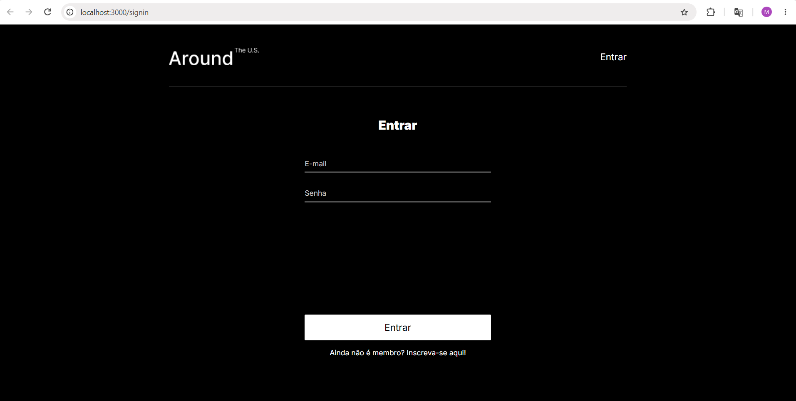
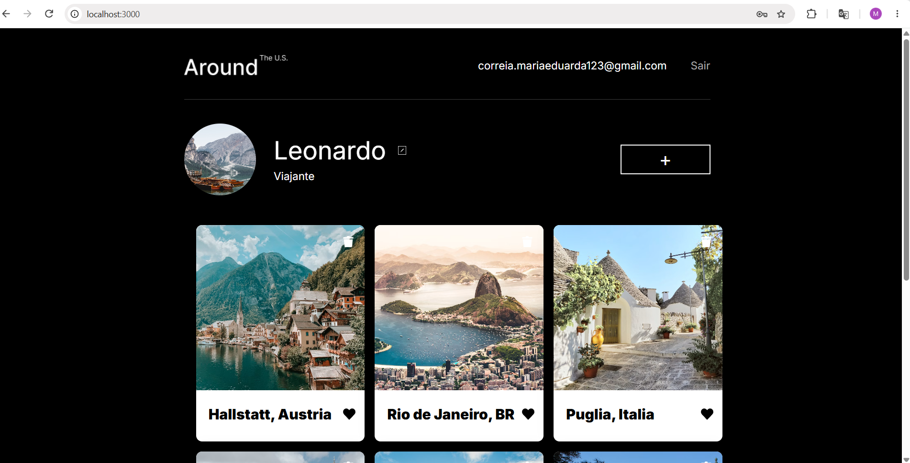

# Tripleten web_project_around_auth

## Descrição

Aplicação web desenvolvida com React que permite visualizar e interagir com cartões de locais. O projeto também possui cadastro, login e autenticação de usuários.

## Tecnologias utilizadas

- React
- JavaScript
- JSX
- CSS
- React Router
- Vite
- REST API
- JWT
- LocalStorage

## Funcionalidades

- Cadastro de usuários
- Login e logout
- Rotas protegidas
- Edição de perfil e avatar
- Adição e exclusão de cartões
- Curtidas nos cartões
- Visualização de imagens em pop-ups
- Layout responsivo para desktop e mobile

## Capturas de tela

Página de login:

Página principal:

## GitHub Pages

[Visualizar o projeto](https://mariateixeira4.github.io/web_project_around_auth/)
